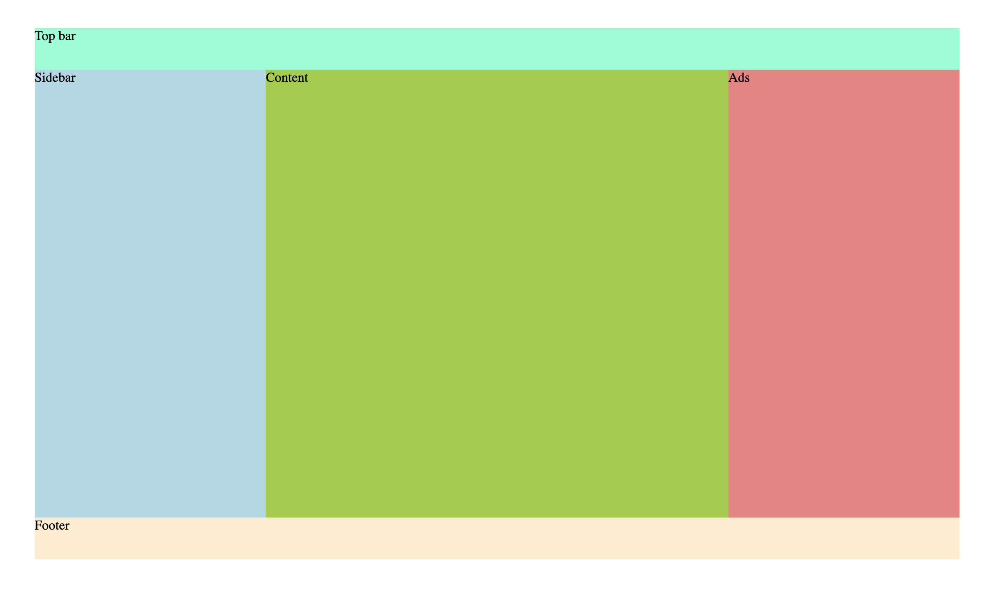
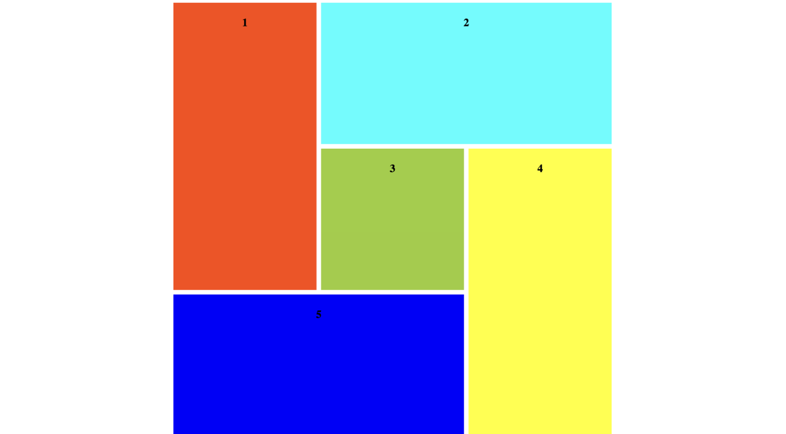

# Project 3: CSS Grid

Przećwiczymy sobie konstruowanie layoutów przy pomocy siatki grid.

W folderach `./ClassicLayout` i `./Mosaic` znajduje się wstępnie przygotowany plik HTML (nie wymaga zmian) i pusty arkusz CSS.

Zależy nam na zakodowaniu niżej przedstawionych layoutów konkretnie przy pomocy grida. Można to zrobić na kilka sposobów ale na potrzeby ćwiczenia nie narzucamy sobie żadnego konkretnego.

### Classic Layout

### Mosaic Layout

