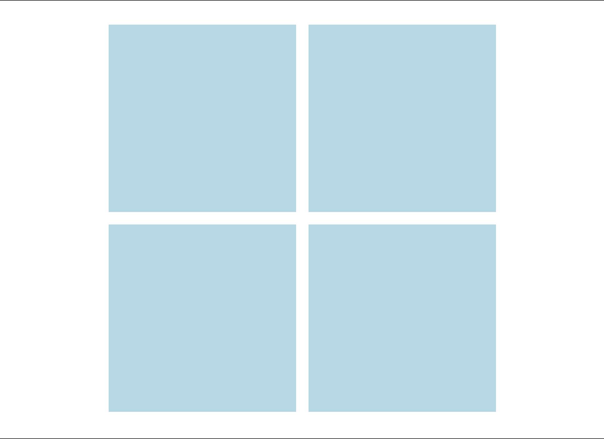

# Projekt 2: layout w HTML i CSS

**Zaczynamy od rozgrzewki [warmup](https://github.com/infoshareacademy/jfdzr13-project-html-css/tree/main/Layout%20w%20HTML%20i%20CSS/warmup)**

W folderach `warmup/position` oraz `warmup/flexbox` znajdują się template html z podlinkowanymi stylami.

Używając metod zgodnych z nazewnictwem ww. folderów odtwórz następującą strukturę:

## Instrukcje:

1. Elementy tworzą "okienko" wycentrowane na stronie.
2. Bok kwadratu ma długość 240px.
3. Odległość między kwadratami to 20px.
4. Kolor ze zdjęcia to `lightblue`.

---

**DLA CHĘTNYCH**:
Po zakończeniu pracy można ją wypchnąć na swoją gałąź:

1.  `git checkout -b warmup-2/[imię-i-nazwisko]`
2.  `git add .`
3.  `git commit -m "warmup"`
4.  `git push --set-upstream origin warmup-2/[imię-i-nazwisko]` i zrobić pull request do maina.

---

## Plan działania

- pracujemy z wtyczką [Live Share Extension Pack](https://www.youtube.com/watch?v=A2ceblXTBBc&t=1s) do VSCode.
- klonujemy to repozytorium
- tworzymy brancha na potrzeby wspólnej pracy `git checkout -b project-2/team-[numer pokoju]`.

Przez pierwszą godzinę pracujecie razem i tym razem chciałbym, żebyście zaczęli od wspólnego rozplanowania projektu:

Przedyskutujcie strukturę strony

- przyjrzyjcie się makietom i zróbcie notatki dzieląc strukturę strony na komponenty, które należy wykonać,
- zaplanujcie co po kolei powinno zostać zrobione, aby zaimplementować taką stronę. Zróbcie notatki punkt po punkcie!

To krótkie ćwiczenie nie powinno wam zająć więcej niż 10-15 minut.

Wynik swojej dyskusji zacommitujcie i wypchnijcie na wspólny branch w pliku solution.md lub pliku solution.txt (wasz wybór) z odpowiednią nazwą commita (commit message nie pozostawiający wątpliwości co do treści wypchniętych zmian).

Następnie przejdźcie do pracy nad projektem.

Commity:

1. Struktura HTML wraz z klasami CSS;
2. Style strony (moliwość ewentualnego rozdzielenia na wiele commitów, w przypadku, gdybyście stylowali komponent po komponencie);

Mockupy:

